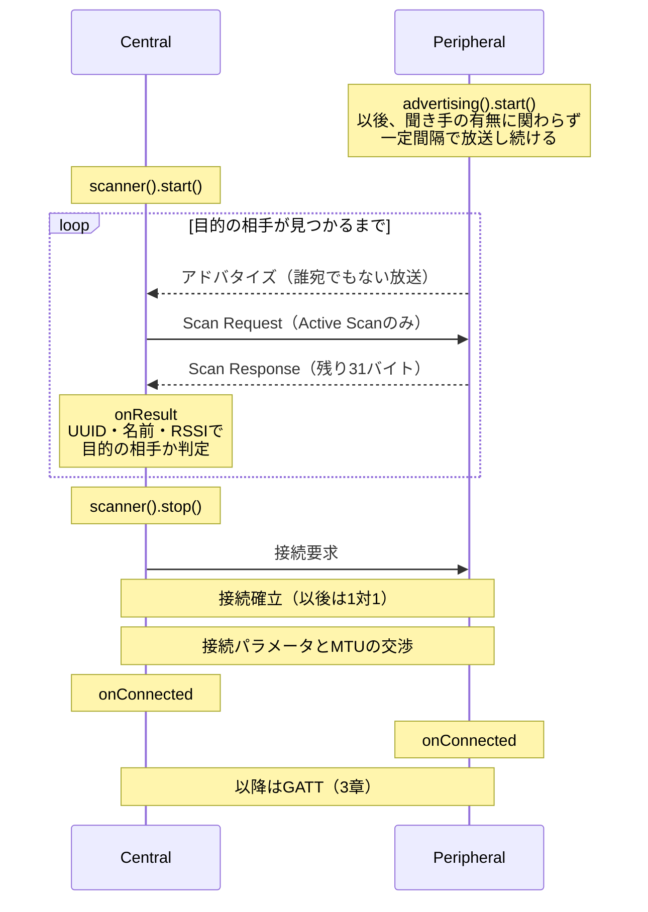

# BLE通信の入門ガイド

BLEを初めて使う人が、**何が起きているのか**を理解するための資料です。用語はすべてこの文書内で説明します。

実際のコードは各exampleにあります。この文書は概念に集中し、対応するexampleへのリンクを示します。

章立てと共通部分は兄弟ライブラリの
[EspBle版ガイド](https://github.com/tanakamasayuki/EspBle/blob/main/docs/GUIDE_BLE_BASICS.ja.md)
を正本とし、Bluedroid固有の対応状況だけを変更しています。

---

## 1. BLEとは

Bluetooth Low Energy（BLE）は、**小さなデータを低消費電力でやり取りする**ための無線規格です。

名前は似ていますが、イヤホンやSPP（Serial Port Profile）で使われてきた**Bluetooth Classicとは別物**で、互換性はありません。

| | Bluetooth Classic | BLE |
|---|---|---|
| 通信の形 | 常時接続のストリーム | 必要なときだけ短くやり取りするイベント指向 |
| 向いているもの | 音声（A2DP/HFP）、シリアル（SPP） | センサー値、キー入力、設定値 |
| 消費電力 | 大きい | ボタン電池で年単位を狙える |

EspBleBluedroidの対象である無印ESP32は、BLEとBluetooth Classicの両方を搭載しています。このガイドではBLEだけを扱い、ClassicのInquiry、SPP、pairingは[Bluetooth Classic通信の入門ガイド](GUIDE_CLASSIC_BASICS.ja.md)へ分離します。BLEのconnectionとClassicのSPP sessionは別物であり、API上も混ぜません。

### 1.1 GAPとGATT — 2つの層

BLEを理解する最初の鍵は、**GAPとGATTという2つの層がまったく別の仕事をしている**ことです。

| | GAP（Generic Access Profile） | GATT（Generic Attribute Profile） |
|---|---|---|
| 担当 | **探す・つながる** | **やり取りする** |
| 扱うもの | アドバタイズ、スキャン、接続、アドレス | Service、Characteristic、値の読み書き |
| いつ使うか | 接続が成立するまで | 接続が成立した後 |

一言でいえば、**探して繋ぐまでがGAP、繋がった後の会話がGATT**です。この文書は2章でGAP、3章でGATTを扱います。

### 1.2 4つの役割 — 2つの独立した軸

BLEには役割を表す言葉が4つ出てきます。混乱しやすいのは、これが**独立した2つの軸**だからです。

**軸1: リンクの役割（GAPの話）**

- **Peripheral（周辺機器）** — アドバタイズして待つ側。接続を**受け入れる**
- **Central（親機）** — スキャンして探す側。接続を**開始する**

**軸2: データの役割（GATTの話）**

- **GATT Server** — 値を**持っている**側。読み書きに応え、変化を通知する
- **GATT Client** — 値を**使う**側。読み書きを要求し、通知を購読する

典型的には「Peripheral = GATT Server」「Central = GATT Client」ですが、**これは決まりではありません**。接続が確立した後は、どちらの側もServerにもClientにもなれます。たとえばキーボード（Peripheral）がホストの時刻を読みに行けば、それはPeripheralかつGATT Clientです。

BLEの仕様上、ESP32は1台で**CentralとPeripheralを同時に**こなせます。ただし現在のEspBleBluedroid公開APIはCentral 1接続とGATT Clientを先に実装しており、Peripheral connectionの公開snapshotとGATT Serverは未実装です。役割を同一視しない設計は維持し、Server追加時にもこの2軸を崩しません。

### 1.3 大原則 — 要求とイベントは別のタイミング

EspBleBluedroidのAPIを読む前に、必ず知っておくべき約束事です。

BLEの操作はほぼすべて**非同期**です。「接続して」と頼んでもその場では接続しません。無線のやり取りが終わるのは、早くて数十ミリ秒後、遅ければ数十秒後です。

そこでEspBleBluedroidは操作を2段階に分けています。

1. **要求API** — 「お願いを受け付けたか」だけをその場で `bool` で返します。まだ何も完了していません
2. **イベント** — 実際の完了・失敗は、後から登録済みのコールバックへ届きます

そして**すべてのイベントは `loop()` の中で呼ぶ `bluetooth.update()` から配送されます**。

```cpp
void loop() {
  bluetooth.update();  // ここで初めて、溜まっていたイベントがコールバックへ配送される
  delay(1);
}
```

これは意図的な設計です。BLEスタックは専用のタスクで動いており、そこから直接コールバックを呼ぶと、アプリケーションのコードが別スレッドで動くことになります。EspBleBluedroidはイベントを一度キューに溜め、`update()` を呼んだタスク（通常は `loop()`）でのみ配送します。**コールバックの中で共有変数を触っても排他制御が要らない**のはこのためです。

裏を返せば、**`update()` を呼び忘れると何も起きません**。スキャン結果も接続完了も届かず、原因の分かりにくい「動かない」状態になります。

この非同期の性質から、EspBleBluedroidのコードは自然と**連鎖（チェーン）**の形になります。「操作を頼む → その完了イベントの中で次を頼む」の繰り返しです。

---

## 2. GAP編 — 探してつながる

この章はBLE通信の時系列に沿って進みます。**アドバタイズ（Peripheral）→ スキャン（Central）→ 接続（両者）**の順です。

### 2.1 アドバタイズ — Peripheralが存在を知らせる

すべての始まりはPeripheral側の**アドバタイズ**（advertising、広告）です。

アドバタイズとは、**「ここにいます、こういう機器です」という短いデータを周囲へ一定間隔で放送し続ける**ことです。宛先はありません。電波の届く範囲にいる全員が受信できます。

#### 何を載せられるか

アドバタイズのデータは**AD構造**（AD structure）の並びです。それぞれが「長さ・種別・値」の3要素を持ちます。主な種別は次のとおりです。

| 載せるもの | 用途 |
|---|---|
| **Flags** | 「接続可能か」「Classic非対応か」などの基本属性。EspBleBluedroidが自動で付けます |
| **Local Name** | 人間が読む名前。`EspBleBluedroid Sensor` など |
| **Service UUID** | 提供する機能の種別。受信側が絞り込みに使う最も重要な情報 |
| **Service Data** | Service UUIDと組にした値そのもの。センサーが値を放送するときに使う |
| **Manufacturer Data** | ベンダー独自のデータ。iBeaconもこの形式 |
| **Appearance** | 機器の見た目の種別（キーボード、体温計など）。スマホがアイコン表示に使う |
| **Tx Power Level** | 送信電力。受信側がRSSIと組み合わせて距離を推定できる |

#### 31バイトの壁

ここが最初の関門です。**アドバタイズのデータは31バイトしか入りません。**

しかも各AD構造は値のほかに2バイト（長さ＋種別）を消費します。128ビットのService UUIDを1つ載せるだけで、16 + 2 = 18バイト。Flagsの3バイトと合わせると、残りは10バイトしかありません。

この制限を緩める仕組みが**Scan Response**です。受信側が「もっと教えて」と要求すると、Peripheralは**もう1つの31バイト**を返せます。合計62バイトです。

- **アドバタイズ本体** — 近くの全員に届く。相手を判別するための最小限を置く
- **Scan Response** — 要求してきた相手にだけ届く。名前などかさばる情報を置く

EspBleBluedroidは、Scan Responseに何も指定しなければ**デバイス名を自動的にそちらへ置きます**。31バイトを名前で消費しないためです。どちらの面に何を載せるかを自分で決めるときは、`advertising().data()` と `advertising().scanResponse()` がそれぞれの面のビルダーを返します。

> **なぜ31バイトなのか、増やせないのか**
> これはBLE 4.0からある**Legacy Advertising**の仕様上の上限です。BLE 5.0の**Extended Advertising**を使えば255バイトまで拡張できますが、対象の無印ESP32はBLE 4.2 controllerであり、EspBleBluedroidでは利用できません。

#### 接続できるアドバタイズ、できないアドバタイズ

アドバタイズには2種類あります。

- **Connectable** — 「接続していいですよ」という放送。通常のPeripheral（既定）
- **Non-connectable** — 放送するだけで接続は受け付けない。**ビーコン**と呼ばれる形態。`advertising().setConnectable(false)` で切り替える

ビーコンは、値そのものをアドバタイズに載せてしまい、接続という手続きを省きます。温度センサーが5秒ごとに温度を放送する、店舗の棚が識別子を放送する、といった用途です。受信側は接続しないので、**1つのビーコンを何台でも同時に受信できる**という利点もあります。

#### アドバタイズ間隔

放送の間隔は `advertising().setInterval(minMs, maxMs)` で20ミリ秒から10.24秒まで設定できます。トレードオフは明快です。

- **短い** — すぐ見つけてもらえるが、電力を消費する
- **長い** — 電池は持つが、相手が見つけるまで時間がかかる

なお仕様上、Non-connectableなアドバタイズは**100ミリ秒以上**にする必要があります。

#### 関連するexample

| example | 内容 |
|---|---|
| [Gap/Advertise](../examples/Gap/Advertise/) | 名前とService UUIDを載せた最小のアドバタイズ |
| [Gap/ScanResponse](../examples/Gap/ScanResponse/) | 2面に分けて31バイト制限を回避する |
| [Gap/ServiceData](../examples/Gap/ServiceData/) | Service Dataとしてセンサー値を放送する |

### 2.2 スキャン — Centralが相手を探す

Central側は**スキャン**（scanning）で周囲のアドバタイズを受信します。

#### passiveとactive

スキャンには2種類あり、`scanner().start()` へ渡す `EspBleScanConfig` の `active` で選びます。

| | `active` | 動作 | 受け取れるもの |
|---|---|---|---|
| **Active Scan** | `true`（既定） | アドバタイズを受信したら**Scan Request**を送り返す | アドバタイズ本体＋**Scan Response** |
| **Passive Scan** | `false` | ただ聞くだけ。こちらは何も送信しない | アドバタイズ本体のみ |

前節のとおり名前はScan Responseに置かれることが多いため、**名前で相手を探すならActive Scanが必要**です。既定が `true` なのはこのためです。

Passive Scanの利点は、こちらが電波を出さないことです。消費電力が下がり、周囲に自分の存在を知られません。相手を判別するのにService UUIDだけで足りるなら、Passiveで十分です。

#### intervalとwindow

同じく `EspBleScanConfig` に、スキャンの時間を決める設定が2つあります。

- **interval（間隔）** — スキャンを開始する周期。`intervalMilliseconds`
- **window（窓）** — そのうち実際に受信している時間。`windowMilliseconds`

たとえばinterval 100ミリ秒・window 50ミリ秒なら、**受信しているのは半分の時間**です。残り半分は他の処理に使えます。window = intervalにすれば常時受信になりますが、消費電力は最大になります。

スキャンを続ける時間は `durationSeconds` で指定し、`0` なら止めるまで続きます。

#### 見落としの問題

ここが実務で最も引っかかる点です。

アドバタイズは一瞬の放送であり、スキャン側のwindowが閉じている間に飛んできたものは**受信できません**。さらにBLEは3つのチャネルを順に使うため、タイミングによってはさらに取りこぼします。

したがって、**1回スキャンして見つからなくても「その機器が存在しない」とは言えません**。実用的には次のようにします。

- 通常は**3〜5秒**のスキャンを行う
- 周囲にBLE機器が多い環境では、さらに長く取る
- 特定の相手を待つなら、時間無制限で見つかるまでスキャンし続ける

#### 受信結果に何が入るか

1件のスキャン結果（`EspBleScanResult`）には、アドバタイズ（とActive Scanなら Scan Response）から取り出した情報が入ります。`address` / `addressType` / `rssi`（受信強度）/ `connectable` / `name` / `serviceUuids` / `serviceData` / `manufacturerData` です。

目的のService UUIDを持つ相手かどうかは `advertisesService(uuid)` で判定します。UUIDを値として比較するため、短縮形とフル形のどちらで書いても一致します。

RSSIはdBmで、0に近いほど近くにあります。目安として-40は至近、-90はかなり遠い、という感覚です。

#### 重複除外という落とし穴

同じ機器のアドバタイズは繰り返し飛んできます。EspBleBluedroidは既定で**重複を除外**し、1つの機器につき1回だけ通知します。周囲の機器を一覧するだけならこのほうが扱いやすいためです。

ここに落とし穴があります。**payloadが変化し続ける機器では、最初の値しか届きません。** 温度を5秒ごとに更新して放送するセンサービーコンでも、受け取れるのは1回目だけで、以降の更新は「送られてこない」ように見えます。送信側は正常に放送しているので、原因に気づきにくい部類の問題です。

ビーコンの値を追いたいときは、`scanner().start()` へ渡す `EspBleScanConfig` の `wantDuplicates` を `true` にします。この設定はスキャン開始時に反映されるため、動作中に変える場合はスキャンを止めて開始し直してください。

代償は通知の量です。周囲の全機器の全アドバタイズが届くようになるため、処理が追いつかないと取りこぼしが発生します。目的の機器が決まっているなら、絞り込みを先に行ってください。

AppearanceとTx Power Levelも、載っていれば `appearance` と `txPowerLevel`（`hasTxPowerLevel()` で有無を判定）で取り出せます。Tx Powerは特に有用で、**申告された送信電力とRSSIの差が経路損失**になり、距離推定の基礎になります。RSSIだけでは「もともと弱く送っている近くの機器」と「強く送っている遠くの機器」を区別できません。

1件のアドバタイズにService Dataが複数載っていることもあります。その場合は順序に頼らず、`serviceDataFor(uuid, data)` でUUIDを指定して目的のブロックを取り出してください。UUIDは値として比較されるため、16ビットの短縮形で書いても一致します。

#### 関連するexample

| example | 内容 |
|---|---|
| [Gap/Scan](../examples/Gap/Scan/) | アドレス・RSSI・名前を表示する最小のスキャン |

接続の必要がない用途——ビーコンの受信——は、ここで完結します。

### 2.3 接続 — 1対1の関係を作る

目的の相手が見つかったら**接続**します。接続を開始できるのはCentral側だけです。

#### 接続する前に判断する

見つかった端末すべてに接続してはいけません。BLEの同時接続数には上限があり、現在のEspBleBluedroidは**同時に1つのCentral接続**を扱います。目的の相手を選んでから接続してください。

スキャン結果には判断材料が揃っています。

- **Service UUID** — 目的の機能を持っているか。最も確実な判定基準
- **名前** — 人間が識別しやすい。ただし同名の機器がありうる
- **接続可能フラグ** — ビーコンには接続できない
- **アドレス** — 特定の1台だけを狙う場合
- **RSSI** — 「十分近いものだけ」という条件を付けたい場合

複数を組み合わせるのが実用的です。「このService UUIDを持ち、かつRSSIが-70より強いもの」といった具合です。

#### Peripheral側は接続を拒否できるか

**アプリケーションのコードでは拒否できません。**

BLEには「接続要求が来ました、承認しますか？」という問い合わせの仕組みがありません。接続の可否はコントローラ（無線チップ側）が判断し、アプリケーションが知るのは接続が成立した後です。

制限したい場合の手段は3つあります。

| 手段 | 効果 | 使うAPI |
|---|---|---|
| **Filter Accept List** | 許可リストに載っていない相手の接続要求をコントローラが黙って捨てる。EspBleBluedroidでは未実装 | 現在は利用不可 |
| **接続後に切断する** | 相手を見て切断する。一度は接続が成立してしまう | `onConnected()` の中で `disconnect()` |
| **属性を暗号化で守る** | 接続は許すが、値の読み書きにペアリングを要求する | Characteristicの `encryptedRead` / `encryptedWrite` |

なお拒否された相手に「拒否された」とは伝わりません。Link Layerに拒否を返すPDUが存在せず、要求が無視されるだけだからです。相手側からは応答のないタイムアウトに見えます。

#### 接続が成立したら

接続すると、以降のやり取りは**その1対1のリンクの中だけ**で行われます。アドバタイズのように周囲へ漏れることはありません。

接続には次のパラメータがあり、通信の応答性と消費電力を決めます。

- **Connection Interval** — 通信機会の周期。短いほど応答が速く、電力を食う
- **Peripheral Latency** — Peripheralが応答をスキップしてよい回数。送るものがないときに電力を節約する
- **Supervision Timeout** — この時間だけ通信が途絶えたら切断とみなす

EspBleBluedroidはこれらを`EspBleConnection::connectionInterval`、
`peripheralLatency`、`supervisionTimeout`へ格納します。単位はBLE仕様のままで、
Intervalは1.25ms、Timeoutは10ms、Latencyはskip可能なconnection event数です。

接続後は`updateConnectionParameters()`で希望範囲を要求できます。戻り値は要求の受付で、
合意値は`onConnectionParametersUpdated()`へ更新済みconnection snapshotとして届きます。
相手が要求と異なる値を選ぶことがあるため、完了callbackの値を正として扱います。
具体的な換算と低遅延・省電力profileは
[Gap/ConnectionParameters](../examples/Gap/ConnectionParameters/)で確認できます。

もう1つ重要なのが**MTU**（Maximum Transmission Unit）です。1回のやり取りで運べるバイト数の上限で、接続時に両者が希望値を交換し、**小さい方**が採用されます。

MTUの仕様上の最小値は23バイトです。このうち3バイトはプロトコルのヘッダが使うため、実際に運べるのは**20バイト**しかありません。EspBleBluedroidの既定希望値はEspBleと同じ247です。`preferredMtu`で希望値を指定できますが、相手と交渉した小さい方が採用されます。

接続直後のMTUは23です。交換が完了すると`onMtuChanged()`へ`EspBleMtuChanged`が届き、`previousMtu`と更新後の`connection.mtu`を確認できます。現在値は `EspBleConnection::mtu`、1回で送れる実バイト数は `maximumNotificationPayload()` で確認できます。

接続が切れると切断イベントが届きます。`onDisconnected()`へ渡される`EspBleConnection::disconnectReason`はHCIの切断理由で、理由を取得できない場合だけ0です。`onConnected()`と`onMtuChanged()`ではまだ切断されていないため0です。Bluedroidの公開経路ではローカルから送る任意の理由を正しく指定できないため、`disconnect()`に理由指定overloadはありません。

#### 関連するexample

| example | 内容 |
|---|---|
| [Gap/Connect](../examples/Gap/Connect/) | Service UUIDで絞り込んで接続し、接続・切断・失敗を受け取る |
| [Gap/Mtu](../examples/Gap/Mtu/) | 希望MTU、交換event、Notification payload上限を確認する |

EspBleとの現在の一致範囲とbackend固有の制約は
[EspBle（NimBLE）とのBLE差分](BLE_BACKEND_DIFFERENCES.ja.md)にまとめています。

### 2.4 アドレスとプライバシー

アドバタイズには必ず送信元の**アドレス**（6バイト）が載ります。ここに問題があります。

工場出荷時のアドレス（**Public Address**）をそのまま使うと、**その値が変わらないため、周囲の誰でもあなたの機器を追跡できます**。持ち歩く機器では現実的な問題です。

BLEはこれに対して3種類のアドレスを用意しています。

| 種別 | 性質 | 追跡耐性 |
|---|---|---|
| **Public** | 工場出荷の固定値 | なし |
| **Random Static** | 起動時に生成する固定のランダム値 | 出荷アドレスは隠せるが、値自体で追跡できる |
| **Resolvable Private Address（RPA）** | コントローラが定期的に変える | 高い |

RPAは一定時間ごとにアドレスを変えるので、外から見ると別の機器になります。しかしそれでは**正規の相手も見失ってしまいます**。

これを解決するのが**ボンディング**（bonding）です。ペアリング時に**IRK**（Identity Resolving Key）という鍵を交換しておくと、相手はその鍵でRPAを計算し、「これはあのときの機器だ」と復元できます。鍵を持たない第三者には、ただの変化するアドレスにしか見えません。

つまり**RPAはボンディングとセットでのみ意味を持ちます**。ボンディングなしでRPAを使うと、相手は再接続できなくなります。

ボンディング済みの相手を指す不変のアドレスを**Identity Address**と呼びます。Filter Accept Listがアドレスで照合する以上、RPAを使う相手を許可リストに載せられるのは、ボンディングしてIdentity Addressが効くようになってからです。

EspBleBluedroidは現在、own addressの種別選択、`localAddress()`、RPA、Filter Accept Listを公開していません。この節の仕組みはBLE全体を理解するために重要ですが、現時点では利用可能なAPIの説明ではありません。Bluedroidのprivacy設定とbond済みpeerのidentity解決を実機で確認してから追加します。

### 2.5 初期化時に決めること

GAPの締めくくりとして、通信を始める前に決めておく設定をまとめます。これらは初期化時に指定し、以降の通信全体に影響します。

いずれも `EspBleConfig` に指定して `begin()` へ渡します。

| 設定 | 内容 | フィールド |
|---|---|---|
| **デバイス名** | アドバタイズや接続後に相手へ見せる名前 | `deviceName` |
| **希望MTU** | 1回で運べるサイズ。既定247 | `preferredMtu` |
| **BLEセキュリティ** | LE pairing・bondingの有効化と認証方式 | `security` |
| **Classicセキュリティ** | Classic pairingとlink keyの設定。BLEとは独立 | `classicSecurity` |

希望MTUを大きくすると1回の転送効率は上がりますが、相手も対応している必要があります。既定247は希望値であり、相手が185までなら合意値は185になります。確保可能な最大packetを常時heapへ予約する設計ではないため、PSRAMは必要ありません。

送信電力を変更する公開APIは未実装です。Advertisingへ現在値をTx Power Levelとして含めることと、受信したTx Power Levelを読むことはできます。

セキュリティには、確認なしでリンクを暗号化する**Just Works**と、6桁の数字で相手を確認する**Passkey認証**があります。目的が「盗聴を防ぐ」だけならJust Worksで足り、「意図しない相手との接続を防ぐ」までを求めるならPasskey認証が必要です。

関連するexample: [Security/JustWorksClient](../examples/Security/JustWorksClient/)、[Security/StaticPasskeyClient](../examples/Security/StaticPasskeyClient/)

### 2.6 時系列で見る全体像（GAP）

アドバタイズから接続確立までを1本の流れにすると次のようになります。Scan Requestは**Active Scanのときだけ**送られます。



接続の必要がないビーコン用途では、`onResult` までで完結します。

### 2.7 GAPで対応していないこと

BLEの仕様にはあるが、EspBleBluedroidでは使えない機能です。理由もあわせて挙げます。

#### Directed Advertising（送信できない）

**Directed Advertising**は、相手を1台に限定したアドバタイズです。通常のアドバタイズが「誰でもどうぞ」と放送するのに対し、これは**送信先のアドレスを指定**し、その相手だけが接続できます。ボンディング済みの相手へ素早く再接続する用途で使われ、特に**High Duty Cycle Directed Advertising**は3.75ミリ秒間隔で最大1.28秒間送出し、極めて短時間で再接続を成立させます。

EspBleBluedroidでは**送信できません**。現在使用しているArduino-ESP32のAdvertising wrapperは送信先アドレスを公開APIから受け取らず、EspBleBluedroidにも指定APIがないためです。

Filter Accept Listも未実装なので、現在の代替は通常のAdvertisingを行い、接続成立後にpeerを確認して不要な接続を切る方法です。一度は接続が成立するため、Directed Advertisingと同等ではありません。

**受信側の挙動**は次のとおりです。

- 自分宛のDirected Advertisingだけがスキャン結果に届きます。他人宛のものはコントローラが破棄します
- 届いた結果は**アドレス・アドレス種別・RSSIだけ**を持ちます。Directed Advertisingは仕様上ADデータを一切載せられないため、名前もService UUIDもありません
- 接続可能フラグは立ち、スキャン応答可能フラグは立ちません
- そのまま通常どおり接続できます
- ただし**「これはDirected Advertisingだ」と判別する手段はありません**。EspBleBluedroidがアドバタイズ種別を公開していないためです。「接続可能・スキャン応答不可・データが空」という組み合わせから推測することになります

#### Extended Advertising / Periodic Advertising

BLE 5.0で追加された、255バイトまでのペイロードを扱う仕組み（Extended）と、接続せずに定期的なデータ配信を受ける仕組み（Periodic）です。

**使えません。** 対象の無印ESP32はBLE 4.2 controllerで、BLE 5.0のExtended Advertisingへ対応しません。Periodic AdvertisingはExtended Advertisingの上に成り立つため、同様に利用できません。

結果として、アドバタイズは31バイト × 2面（本体とScan Response）が上限になります。

#### スキャン側のFilter Accept List

Filter Accept Listは、アドバタイズ側（誰の接続を受けるか）だけでなく、**スキャン側**（誰のアドバタイズを受け取るか）にも適用できる仕組みが仕様上あります。

EspBleBluedroidではAdvertising側・Scan側とも公開APIが未実装です。スキャン結果の絞り込みは、受け取った後にapplication側で判定します。

#### 接続時のパラメータ指定

接続を開始する時点でConnection IntervalやPHYを指定することは**できません**。同梱backendの接続APIが指定を受け付けないためです。

接続後のConnection Interval、Peripheral Latency、Supervision Timeoutは
`updateConnectionParameters()`で変更を要求できます。PHY変更は未実装です。対象の
無印ESP32 controllerは1M PHYだけを利用でき、2M/Coded PHYは追加できません。

#### アドバタイズチャネルの選択

アドバタイズは3つのチャネル（37・38・39）を使いますが、そのうち一部だけを使う設定は**できません**。現在の公開APIはチャネルマップを扱わず、常にbackend既定の3チャネルを使います。
